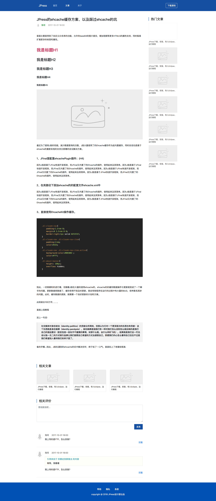

# BlueLight

### 模板描述

BlueLight是设计师Jean为JPress官网所设计，目前已开源。
BlueLight是一个响应式，专业，多用途的模板，采用Bootstrap 4编写。
BlueLight模板设计和谐干净，风格简约大气，动画效果自然舒适。代码规范，自适应能力强，兼容性强，可在所有主流web浏览器、平板电脑和手机上无缝运行。

### 模板特点

* 采用HTML5和CSS3编写；
* 采用Bootstrap 4编写；
* 响应式布局（台式机、平板电脑、移动设备）
* 对于后台开发，代码友好；
* 清新、现代化设计；
* 自然舒适动画效果；
* 支持各类型代码高亮显示；

### 浏览器支持

BlueLight支持所有现代浏览器（Chrome，Firefox，Safari），包括IE11和Edge。

### 效果展示

### 联系Jean

* 有关本模板的任何问题，欢迎添加Jean讨论；
* 后续更多开源模板，请添加Jean持续关注；
* 需要sketch文件，Jean很乐意分享；
* 喜欢Jean的风格，期待找Jean定制。
* 